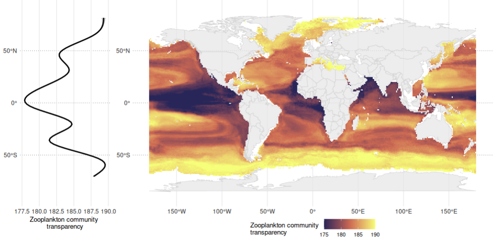
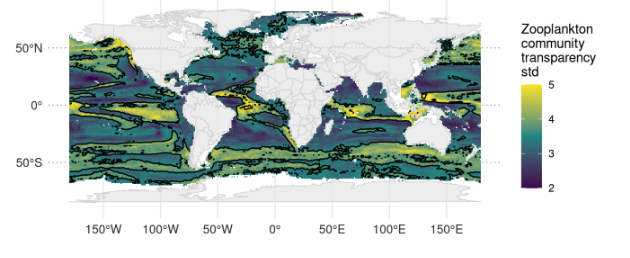

# Cephaloplot

This folder includes companion functions to the CEPHALOPOD pipeline (<https://github.com/alexschickele/CEPHALOPOD>) to **extract, process and plot model outputs** [**in R**]{.underline}.

This set of functions will later be turned into a package but are, for now, available to download and uss as is show in the tutorials.

The *Extracting_tutorial.qmd* and *Plotting_tutorial.qmd* in the *scripts* folder give detailed explanations and examples on how to use the different functions (data are standard outputs from Cephalopod but too large to be included in this repository). You can find the version with both code and extraction or plot outputs associated at:

-   [Extraction tutorial](https://virginiesonnet.github.io/Cephaloplot/scripts/extract_site/)
-   [Plotting tutorial](https://virginiesonnet.github.io/Cephaloplot/scripts/plot_site/)

| Type     | Function              | Description                                                                                                                                                                                                                                                                                                                                                                                                                                                                                                                                                                                                                                                                                                                                                                 |
|------------------|------------------|-----------------------------------|
| extract  | extract_observations  | Extract initial input observations                                                                                                                                                                                                                                                                                                                                                                                                                                                                                                                                                                                                                                                                                                                                          |
| extract  | extract_performance   | Extract R2, cumulative variable importance and normalized standard deviation for each or a certain model                                                                                                                                                                                                                                                                                                                                                                                                                                                                                                                                                                                                                                                                    |
| extract  | extract_predictors    | Extract list of all input predictors or selected predictors with their mean, median and standard deviation importance in each or a specific model                                                                                                                                                                                                                                                                                                                                                                                                                                                                                                                                                                                                                           |
| extract  | extract_prediction    | Extract projections for all models (ensemble = FALSE) or for an ensemble model (ensemble = TRUE) of either the models that passed the QC, or a specific list of models (variable model is indicated). When ensemble = FALSE, values are returned for each model, month, (varfactor) and grid cell: mean and standard deviation across bootstraps, normalized standard deviation (std / max mean in the model) and coefficient of variation (std/mean). When ensemble = TRUE, values are returned for each grid cell: mean and standard deviation (first calculated across bootstraps, then averaged over specified months and varfactors, then averaged over models), normalized standard deviation (std / max mean across models) and coefficient of variation (std/ mean) |
| extract  | extract_land          | Extract land mask (for D4science predictors, you can use the land.csv)                                                                                                                                                                                                                                                                                                                                                                                                                                                                                                                                                                                                                                                                                                      |
| category | predictor_categories  | Associate a (subjective) broad category to each predictor - highly dependent on the format of predictor names (for D4science predictors, you can use predictor_categories.csv)                                                                                                                                                                                                                                                                                                                                                                                                                                                                                                                                                                                              |
| plot     | plot_latitude_profile | Plot a loess or gam profile of the data                                                                                                                                                                                                                                                                                                                                                                                                                                                                                                                                                                                                                                                                                                                                     |
| plot     | plot_observations     | Plot the original observations                                                                                                                                                                                                                                                                                                                                                                                                                                                                                                                                                                                                                                                                                                                                              |
| plot     | plot_performance      | Plot model metrics (performance, CUM VIP, NSD) together or separate                                                                                                                                                                                                                                                                                                                                                                                                                                                                                                                                                                                                                                                                                                         |
| plot     | plot_prediction       | Plot predicted values or anomaly, with or without uncertainty as a map, a bivariate map or stippling                                                                                                                                                                                                                                                                                                                                                                                                                                                                                                                                                                                                                                                                        |

[Below are examples of maps from the plot functions]{.underline}:

       
